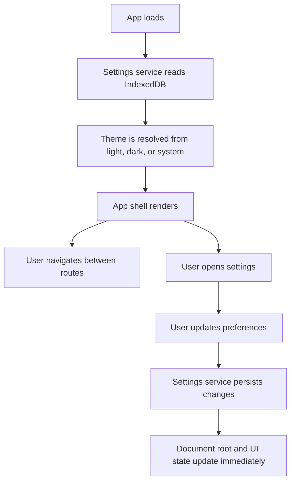

## 1. Product Overview
This project is a frontend-only foundation for a personal productivity-style React web app.
- It provides a clean scaffold for navigation, routing, local settings, theming, and IndexedDB persistence without implementing full product features yet.
- Its value is fast, maintainable iteration on future inbox, projects, items, tags, and search experiences using a stable frontend architecture.

## 2. Core Features

### 2.1 Feature Module
1. **Shell and navigation**: app shell, desktop sidebar, mobile top bar, mobile drawer, active route states
2. **Routing foundation**: placeholder pages for all required routes using React Router
3. **Settings system**: theme mode, accent color, compact mode, reduced motion, local persistence
4. **Local data layer**: IndexedDB-backed settings storage with expansion-friendly structure

### 2.2 Page Details
| Page Name | Module Name | Feature description |
|-----------|-------------|---------------------|
| Home | Overview placeholder | Landing placeholder for the root route with scaffold overview |
| Inbox | Page placeholder | Simple page shell reserved for future inbox features |
| Projects | Page placeholder | List-level projects placeholder |
| Project Detail | Dynamic route placeholder | Placeholder for `/projects/:projectId` |
| Item Detail | Dynamic route placeholder | Placeholder for `/items/:itemId` |
| Tags | Page placeholder | Placeholder for tag-based organization |
| Search | Page placeholder | Placeholder for future search UI |
| Settings | Preferences UI | Controls for theme mode, accent color, compact mode, and reduced motion |

## 3. Core Process
Users open the app, move between placeholder routes using responsive navigation, adjust personal preferences in settings, and have those preferences restored from IndexedDB on refresh. On desktop, navigation remains persistently visible. On mobile, navigation opens in a touch-friendly drawer that can be dismissed by swipe or direct action.

## 4. User Interface Design
### 4.1 Design Style
- Primary palette: warm neutrals with adaptable accent color tokens
- Surface style: soft panels, subtle borders, calm shadows, rounded corners
- Typography: modern sans-serif system stack for readability and maintainability
- Layout style: responsive app shell with sidebar on desktop and drawer navigation on mobile
- Icon style: simple line icons for clarity and low visual noise

### 4.2 Page Design Overview
| Page Name | Module Name | UI Elements |
|-----------|-------------|-------------|
| Global shell | Sidebar and top bar | Logo area, navigation items, current-route highlight, settings shortcut |
| Mobile navigation | Drawer | Large touch targets, clear close affordance, swipe-to-close interaction |
| Content area | Route outlet container | Independent scrolling region, responsive spacing, readable widths |
| Settings | Preference controls | Toggle groups, switches, color pickers/buttons, explanatory helper text |

### 4.3 Responsiveness
- Desktop-first shell with a persistent sidebar from medium or large breakpoints upward
- Mobile-adaptive top navigation with slide-in drawer for smaller screens
- Touch-friendly hit areas and swipe-friendly close behavior for the drawer
- Main content scroll region remains usable without shifting global navigation structure
