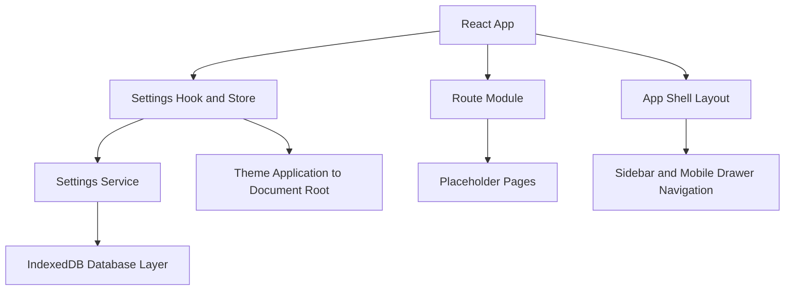

## 1. Architecture Design


## 2. Technology Description
- Frontend: React + TypeScript + Vite
- Styling: Tailwind CSS with class-based dark mode
- Routing: React Router
- Persistence: IndexedDB via a lightweight browser database helper
- Backend: None
- Authentication: None
- Collaboration and cloud sync: None

## 3. Route Definitions
| Route | Purpose |
|-------|---------|
| / | Home placeholder and scaffold overview |
| /inbox | Inbox placeholder page |
| /projects | Projects placeholder page |
| /projects/:projectId | Project detail placeholder page |
| /items/:itemId | Item detail placeholder page |
| /tags | Tags placeholder page |
| /search | Search placeholder page |
| /settings | Settings page for theme and local preferences |

## 4. Data Definitions
```ts
export type ThemeMode = 'light' | 'dark' | 'system'

export type AccentColour =
  | 'amber'
  | 'coral'
  | 'rose'
  | 'violet'
  | 'sky'
  | 'emerald'

export interface AppSettings {
  themeMode: ThemeMode
  accentColour: AccentColour
  compactMode: boolean
  reducedMotion: boolean
}

export interface NavigationItem {
  label: string
  to: string
  icon: string
  match?: 'exact' | 'prefix'
}
```

## 5. Frontend Structure
- `src/components`: shared UI building blocks
- `src/components/layout`: shell and structural layout components
- `src/components/navigation`: desktop and mobile navigation components
- `src/components/settings`: settings-specific UI controls
- `src/pages`: route-level placeholder pages
- `src/routes`: router configuration and route definitions
- `src/hooks`: reusable hooks such as settings and theme handling
- `src/services`: app-facing service layer such as settings persistence
- `src/types`: TypeScript interfaces and unions
- `src/lib`: small utilities and theme helpers
- `src/db`: IndexedDB setup and future data expansion layer
- `src/styles`: Tailwind entry styles and shared CSS variables

## 6. Persistence Strategy
- Use a dedicated IndexedDB database module at `src/db/database.ts`
- Create an object store for application metadata and settings
- Store a single `app-settings` record initially while keeping the schema open for future stores such as projects, items, and tags
- Expose persistence through `src/services/settingsService.ts` so components do not depend directly on IndexedDB details
- Load settings on startup, apply them to the document root, and write changes back immediately after user updates
